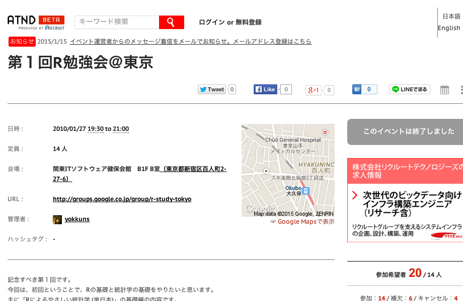

---
# Lab.note package ver. 0.2.11
title: \fontspec{DOCKER THREE}Tokyo.Rの闇
subtitle: Tokyo.R#46 LT
author: \faTwitter \fontspec{DOCKER TWO}@u_ribo
date: \fontspec{DOCKER TWO}February 21, 2015
header-includes:
# define macro
    - \definecolor{Black1}{HTML}{36353B}
    - \definecolor{White1}{RGB}{255, 255, 250}
    - \definecolor{Blue1}{HTML}{5FB8FC}
    - \definecolor{Blue2}{HTML}{29F6E7}
    - \definecolor{Green1}{HTML}{17CCB7}
    - \definecolor{Yellow1}{HTML}{FEE08C}
    - \definecolor{Red1}{HTML}{F7417A}
# using package, setup
    - \usepackage{zxjatype}
    - \setjamainfont{Hiragino Kaku Gothic Pro}
    - \usepackage{fontspec, fontawesome} # require installed FontAwesome
    - \usepackage{scrextend}
    - \changefontsizes{22pt}
## comment out when if you using image for slide background 
#   - \usebackgroundtemplate{\includegraphics[width = \paperwidth, height = \paperheight]{...png}}
# set beamer theme
    - \setbeamercolor{background canvas}{bg = Black1}
    - \setbeamertemplate{navigation symbols}{}
    - \setbeamertemplate{itemize items}{\textcolor{Blue2}{\faCaretRight}}
    - \setbeamerfont{title}{size = \fontsize{48}{10}}
    - \setbeamercolor{title}{fg = Blue2}
    - \setbeamerfont{subtitle}{size = \large}
    - \setbeamercolor{subtitle}{fg = Blue1}
    - \setbeamercolor{author}{fg = Green1}
    - \setbeamercolor{normal text}{fg = Yellow1}
    - \setbeamerfont{date}{series = \itshape}
    - \setbeamercolor{date}{fg = Red1}
    - \setbeamercolor{frametitle}{fg = Blue2}
# new command
    - \renewcommand{\baselinestretch}{1.0}
output:
  beamer_presentation:
    fonttheme: "structurebold"
    keep_tex: false
    pandoc_args:
     ["--latex-engine=xelatex"]
mainfont: Helvetica Neue
monofont: Ricty
linkcolor: blue
urlcolor: Red1
citecolor: Black1
---

```{r global_options, child = "document_setting.Rmd"}
```

## 自己紹介

* 闇の大学院生(Yokohamaｶﾗｷﾏｽﾀ)
* R歴... ５年目？（ほとんど初心者）
    * Rの師匠
        * 昔: @nozma, Tsukuba.Rのみなさん
        * 今: @hadleywickham, @xieyihui, pipeR三銃士
        * 最近: @yutannihilation, @kos59125
        

```{r using_pkg}
library("webshot")
```

## \center{
  祝\textbf{{\fontspec{DOCKER THREE}Tokyo.R\#46}}
}

---

\center{
  \footnotesize{\textcolor{Red1}{（BGMは各自で脳内補完ください）}}\\
  \scriptsize{遠い昔(2010年1月27日)、小さな島国の都市で...}\\
  \scriptsize{@yokkuns を中心メンバーとして始まった日本のRコミュニティ...\textcolor{Red1}{Tokyo.R}が産声を上げた。数多の困難（\textcolor{Red1}{知らない}）を乗り越え、途切れることなく続いてきたTokyo.Rは数々の参加者に支えられながら、現在、日本のRコミュニティで\textcolor{Red1}{最も大きく活発なコミュニティ}となっていくのであった...}
}

---

```{r atnd_tokyor, eval = FALSE}
webshot(url = "https://atnd.org/events/2746", file = "images/atnd_tokyor.png", cliprect = "viewport")
```



\faLink \url{https://atnd.org/events/2746}

---

そんなわけで過去のTokyo.Rを振り返り！

---

なんてことがしたい人生だった

```{r, eval=FALSE}
webshot("https://twitter.com/u_ribo/status/566851435392811008", "test150201.png", 
        selector = "#page-container")
# https://twitter.com/yamano357/status/566860122928861184
```


---

## Atnd apiを叩く

選考基準

* 同一IDであること
    * e.g. `Tokorosawa Yoshio`, `所沢義男` は別ID扱い（ごめんね :b）

## 参加者数の推移

## 参加者の内訳

対象: 去年一年間（#36-#44）

## 最多参加数トップテン

1. (28)... yokkuns(tw:yokkuns)
1. (28)... aad34210
3. (25)... bob3(tw:bob3bob3)
4. (23)... teramonagi(tw:teramonagi)
5. (20)... mikado_hito(tw:mikado_hito)
5. (20)... Hiro_macchan(tw:Hiro_macchan)
7. (19)... manozo(tw:manozo)
7. (19)... atg
7. (19)... soultoru(tw:soultoru)
10. (18)... holidayworking(tw:holidayworking)

## 最多発表数トップテン

殿堂入り

## ん？

参加回数１回の人多くね？？

https://twitter.com/u_ribo/status/550872628420804608

Tokyo.R = 敷居が高いイメージ

## これからのTokyo.R

どうするんですか？

GitHubにリポジトリ作るとか

初心者セッション -> 都度変更点を修正するだけで良い！

もっと世界に目を向けてみるとか

頑張れ英語勢

R-Bloggers

## 謝辞

Tokyo.Rをはじめ各地のRコミュニケーション運営に関わる皆さま

R勉強会、コミュニティの発表をまとめてくださる方（Special Thanks）

## Check font size

\center{
  Default 22 pt\\(see line 18 in this file)
  
  \begin{itemize}
    \item \small{small}
    \item \footnotesize{footnotesize}
    \item \scriptsize{scriptsize}
    \item \tiny{tiny}
  \end{itemize}
}

## Check font size

\center{
  Default 22 pt\\(see line 18 in this file)
  
  \begin{itemize}
    \item \Large{Large}, \LARGE{LARGE}
    \item \huge{huge}, \Huge{Huge}
  \end{itemize}
}