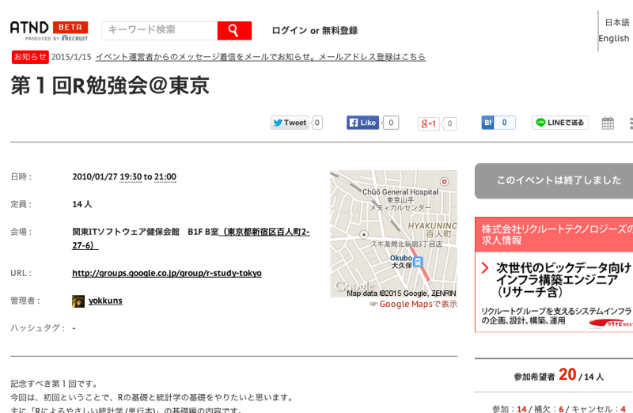
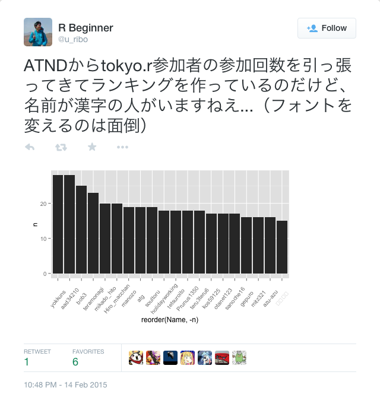

---
# Lab.note package ver. 0.2.11
title: \fontspec{DOCKER ONE}Japan\textcolor{Red1}{.R} \newline 補完計画
subtitle: Tokyo.R#46 LT
author: \faTwitter \fontspec{DOCKER ONE}@u_ribo\vspace{-1cm}
date: \fontspec{DOCKER TWO}February 21, 2015
header-includes:
# define macro
    - \definecolor{Black1}{HTML}{36353B}
    - \definecolor{White1}{RGB}{255, 255, 250}
    - \definecolor{Blue1}{HTML}{5FB8FC} \definecolor{Blue2}{HTML}{29F6E7}
    - \definecolor{Green1}{HTML}{17CCB7}
    - \definecolor{Yellow1}{HTML}{FEE08C}
    - \definecolor{Red1}{HTML}{F7417A}
# using package, setup
    - \usepackage{zxjatype}
    - \setjamainfont{YuGo-Medium}
    - \usepackage{fontspec, fontawesome} # require installed FontAwesome
    - \usepackage{scrextend}
    - \changefontsizes{22pt}
## comment out when if you using image for slide background 
#   - \usebackgroundtemplate{\includegraphics[width = \paperwidth, height = \paperheight]{...png}}
# set beamer theme
    - \setbeamercolor{background canvas}{bg = Black1}
    - \setbeamertemplate{navigation symbols}{}
    - \setbeamertemplate{itemize items}{\textcolor{Blue1}{\faCaretRight}}
    - \setbeamerfont{title}{size = \fontsize{46}{8}}
    - \setbeamercolor{title}{fg = White1}
    - \setbeamerfont{subtitle}{size = \large}
    - \setbeamercolor{subtitle}{fg = Blue1}
    - \setbeamercolor{author}{fg = Blue1}
    - \setbeamercolor{normal text}{fg = Yellow1}
    - \setbeamerfont{date}{series = \itshape, size = \small}
    - \setbeamercolor{date}{fg = White1}
    - \setbeamercolor{frametitle}{fg = Blue1}
# new command
    - \renewcommand{\baselinestretch}{1.0}
output:
  beamer_presentation:
    fonttheme: "structurebold"
    keep_tex: false
    pandoc_args:
     ["--latex-engine=xelatex"]
mainfont: DOCKER ONE
monofont: Ricty
linkcolor: blue
urlcolor: Red1
citecolor: Black1
---

```{r global_options, child = "document_setting.Rmd"}
```

```{r using_pkg}
library("webshot")
```

---

\center{\LARGE{\textbf{祝 {\fontspec{DOCKER ONE}Tokyo.R\#46}}}}

```{r atnd_tokyor, eval = FALSE}
webshot(url = "https://atnd.org/events/2746", file = "images/atnd_tokyor.png", cliprect = "viewport")
# pixelmatorで背景を白で塗りつぶし
```



\tiny{\faLink \url{https://atnd.org/events/2746}}

---

* Tokyo.Rの情報は\textbf{すべてATNDに掲載されている}
* \textbf{ATND API}を叩けば、イベント情報を取得できる

\center{\large{\faArrowRight 過去のTokyo.Rを振り返り！}}

---

```{r, eval = FALSE}
webshot("https://twitter.com/u_ribo/status/566851435392811008", "images/tweet_uribo.png", selector = ".expansion-container")
```



\tiny{\url{https://twitter.com/u_ribo/status/566851435392811008}}

---

```{r, eval=FALSE}
webshot("https://twitter.com/yamano357/status/566860122928861184", "images/tweet_mention_yamano357.png", selector = ".expansion-container")
```


\tiny{\url{https://twitter.com/yamano357/status/566860122928861184}}

---

\center{\large{ATND API を叩いて過去のTokyo.Rを振り返り！}}


---

\center{\textbf{\textcolor{White1}{\fontsize{46}{8}{そんなことが \newpage したい人生だった}}}}

---

同様の発表や記事、調べたら\textbf{たくさん}あった。

---

\center{\Huge{\fontspec{DOCKER ONE}\textcolor{White1}{\#Tsurami}}}

... 勉強会でのネタ被り

---

ぼく「既存の内容に関して、調べが足りませんでした」

???「そうだな。しかし\textbf{\textcolor{White1}{情報が集約されていないのが悪い}}」

ぼく「...集約されていないのが悪い」

---

\Huge{\textbf{\fontspec{DOCKER ONE}\textcolor{White1}{Japan}\textcolor{Red1}{.R} \newline \textcolor{White1}{補完計画}}}

---

第一次中間報告

* **全国のRコミュニティ**の活動をまとめたGitHubリポジトリを作成
* **発表内容をデータセット**に集約した
* **Rパッケージ**として開発中

---

\center{\Huge{\fontspec{DOCKER ONE}\textcolor{White1}{DEMO}}}

\faArrowRight \url{https://github.com/uribo/Japan.useR}

---

## 謝辞

Tokyo.Rをはじめ、各地のRコミュニケーション運営に関わる皆さま、発表者、参加者の皆さま

R勉強会、コミュニティの発表をまとめてくださる方々

（Special Thanks）

---

\center{\Huge{\textcolor{White1}{次回予告}}}

---

## あなたのRプログラミングの「ｼｼｮｰ」は誰ですか

* 昔: @nozma, `Tsukuba.R`の皆さん
* 今: @hadleywickham, @xieyihui, pipeR三銃士
* 最近: @yutannihilation