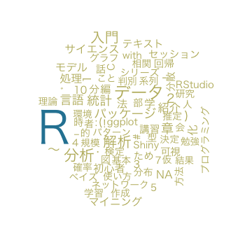

---
# Lab.note package ver. 0.2.11
title: \fontspec{DOCKER ONE}Japan\textcolor{Red1}{.R} \newline 補完計画
subtitle: Tokyo.R#46 LT \vspace{-1em}
author: \faTwitter \fontspec{DOCKER ONE}@u_ribo\vspace{-1cm}
date: \fontspec{DOCKER TWO}February 21, 2015
header-includes:
# define macro
    - \definecolor{Black1}{HTML}{36353B}
    - \definecolor{White1}{RGB}{255, 255, 250}
    - \definecolor{Blue1}{HTML}{5FB8FC} \definecolor{Blue2}{HTML}{29F6E7}
    - \definecolor{Green1}{HTML}{17CCB7}
    - \definecolor{Yellow1}{HTML}{FEE08C}
    - \definecolor{Red1}{HTML}{F7417A}
# using package, setup
    - \usepackage{zxjatype}
    - \setjamainfont{YuGo-Medium}
    - \usepackage{fontspec, fontawesome} # require installed FontAwesome
    - \usepackage{scrextend}
    - \changefontsizes{22pt}
## comment out when if you using image for slide background 
#   - \usebackgroundtemplate{\includegraphics[width = \paperwidth, height = \paperheight]{...png}}
# set beamer theme
    - \setbeamercolor{background canvas}{bg = Black1}
    - \setbeamertemplate{navigation symbols}{}
    - \setbeamertemplate{itemize items}{\textcolor{Blue1}{\faCaretRight}}
    - \setbeamerfont{title}{size = \fontsize{60}{8}}
    - \setbeamercolor{title}{fg = White1}
    - \setbeamerfont{subtitle}{size = \large}
    - \setbeamercolor{subtitle}{fg = Blue1}
    - \setbeamercolor{author}{fg = Blue1}
    - \setbeamercolor{normal text}{fg = Yellow1}
    - \setbeamerfont{date}{series = \itshape, size = \small}
    - \setbeamercolor{date}{fg = White1}
    - \setbeamercolor{frametitle}{fg = Blue1}
# new command
    - \renewcommand{\baselinestretch}{1.0}
    - \providecommand\faSlideshare{{\FA\symbol{"F1E7}}}
output:
  beamer_presentation:
    fonttheme: "structurebold"
    keep_tex: false
    pandoc_args:
     ["--latex-engine=xelatex"]
mainfont: DOCKER ONE
monofont: Ricty
linkcolor: blue
urlcolor: Red1
citecolor: Black1
---

```{r global_options, child = "document_setting.Rmd"}
```

```{r using_pkg}
library("Japan.useR")
library("webshot")
```

---

\center{\LARGE{\textbf{祝 {\fontspec{DOCKER ONE}Tokyo.R\#46}}}}

```{r atnd_tokyor, eval = FALSE}
webshot(url = "https://atnd.org/events/2746", file = "images/atnd_tokyor.png", cliprect = "viewport")
# pixelmatorで背景を白で塗りつぶし
```


\tiny{\faLink \url{https://atnd.org/events/2746}}

---

* Tokyo.Rの情報は\textbf{\textcolor{White1}{すべてATNDに掲載されている}}
* \textbf{\textcolor{White1}{ATND API}}を叩けば、イベント情報を取得できる

\center{\large{\faArrowRight 過去のTokyo.Rを振り返り！}}

---

```{r, eval = FALSE}
webshot("https://twitter.com/u_ribo/status/566851435392811008", "images/tweet_uribo.png", selector = ".expansion-container")
```


\tiny{\faTwitter \url{https://twitter.com/u_ribo/status/566851435392811008}}

---

```{r, eval=FALSE}
webshot("https://twitter.com/yamano357/status/566860122928861184", "images/tweet_mention_yamano357.png", selector = ".expansion-container")
```


\tiny{\faTwitter \url{https://twitter.com/yamano357/status/566860122928861184}}

---

\center{\large{ATND API を叩いて過去のTokyo.Rを振り返り！}}


---

\center{\textbf{\textcolor{White1}{\fontsize{46}{8}{そんなことが \newpage したい人生だった}}}}

---

同様の発表や記事、調べたら\textbf{たくさん}あった。

\begin{itemize}
  \item{\footnotesize{\faSlideshare Tokyo.R\#44 TokyoRの話@yamano357}} %https://speakerdeck.com/yamano357/tokyor44-lt
  \item{\footnotesize{\faSlideshare Tokyo.R\#26 Tokyo.Rの輪@manozo}} %http://www.slideshare.net/manozo/tokyor
  \item{\footnotesize{\faSlideshare Tokyo.R\#17 TokyoRの軌跡@dichika}} %http://www.slideshare.net/dichika/tokyor17-9449827
  \item{\footnotesize{TokyoR2014slideshare閲覧数ランキング}} %http://www.rpubs.com/dichika/rank2014
\end{itemize}

---

\center{\Huge{\fontspec{DOCKER ONE}\textcolor{White1}{\#Tsurami}}}

... 勉強会でのネタ被り

---

ぼく「既存の内容に関して、調べが足りませんでした」

???「そうだな。しかし\textbf{\textcolor{White1}{情報が集約されていないのが悪い}}」

ぼく「...集約されていないのが悪い」

---

\Huge{\textbf{\fontspec{DOCKER ONE}\textcolor{White1}{Japan}\textcolor{Red1}{.R} \newline \textcolor{White1}{補完計画}}}

---

\faBullhorn 第一次中間報告

* \textbf{\textcolor{White1}{全国のRコミュニティ}}の活動をまとめたGitHubリポジトリを作成
* \textbf{\textcolor{White1}{発表内容をデータセット}}に集約した
* \textbf{\textcolor{White1}{Rパッケージ}}として開発中

---

* 主な情報源
    * \footnotesize{勉強会発表内容一覧 \faLink http://lab.sakaue.info}
    * \footnotesize{ATND}
    * \footnotesize{INPUTしたらOUTPUT! \faLink http://estrellita.hatenablog.com}
* 使用パッケージ... \footnotesize{\textit{\textcolor{White1}{rvest, stringr, dplyr, magrittr, Nippon, RJSONIO, RCurl...}}}
* ATND APIはJSON形式で取得。リストの使い方難しい...

---

\center{\Huge{\fontspec{DOCKER ONE}\textcolor{White1}{DEMO}}}

\faGithub \url{https://github.com/uribo/Japan.useR}

---

Tokyo.R#1の発表内容を確認

> \textcolor{White1}{materials(community = "Tokyo.R", number = 1)}

---

Tsukuba.R, Hiroshima.Rも

> \textcolor{White1}{materials(community = "Tsukuba.R")}

> \textcolor{White1}{materials(community = "Hiroshima.R", number = 1, session = 2)}

---

発表資料を閲覧 \newline（引数 browse = TRUE）

> \textcolor{White1}{materials("Tokyo.R", 45, 5, browse = TRUE)}

---

特定の発表者の発表を表示

> \textcolor{White1}{speaker(id = "u\_ribo")}

---

データセットを使って...

> \textcolor{White1}{DT::datatable("JRSlide")}

---

データセットを使って...

> \textcolor{White1}{grep("R", JRSlide\$Title, value = TRUE)}

---

データセットを使って...

```{r, eval = FALSE}
data("JRSlide")
df <- data.frame()
for (i in 1:nrow(JRSlide)) {
  x <- RMeCab::RMeCabC(JRSlide$Title[i], 1)
  x <- unlist(x)[names(unlist(x)) == "名詞"]
  x <- data.frame(x)
  df <- rbind(df, x)
}
dd <- table(df$x) %>% data.frame()
wordcloud::wordcloud(dd$Var1, dd$Freq, scale=c(4, .8), min = 5, colors = c("#bdb76b", "#2a83a2"))
```



---

\faTrash ボツ関数

* 主催者(yokkuns)にメンションを飛ばす
* 勉強会で話題になった「言葉」を出力
* DYM::DYM("dichika")... 発表者のID、もしかして機能

---

\faGroup 謝辞

Tokyo.Rをはじめ、各地のRコミュニケーション運営に関わる皆さま、発表者、参加者の皆さま

R勉強会、コミュニティの発表をまとめてくださる方々
